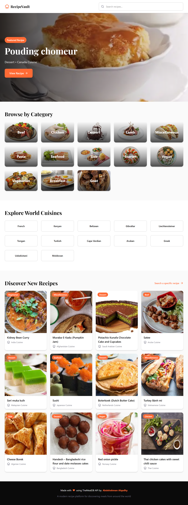
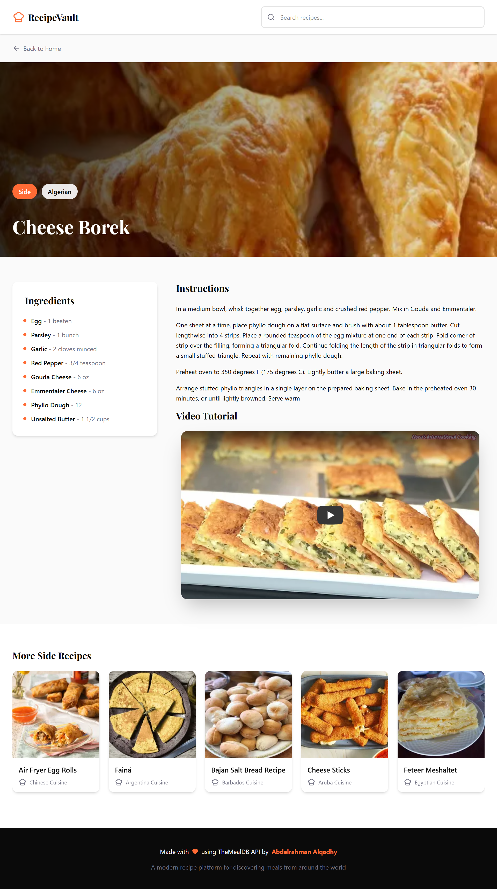
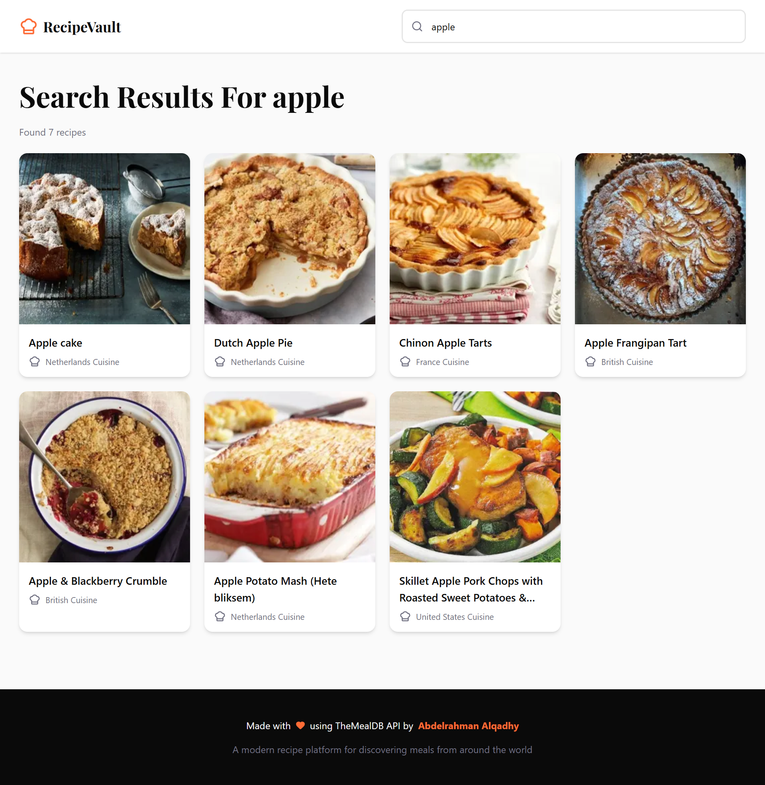
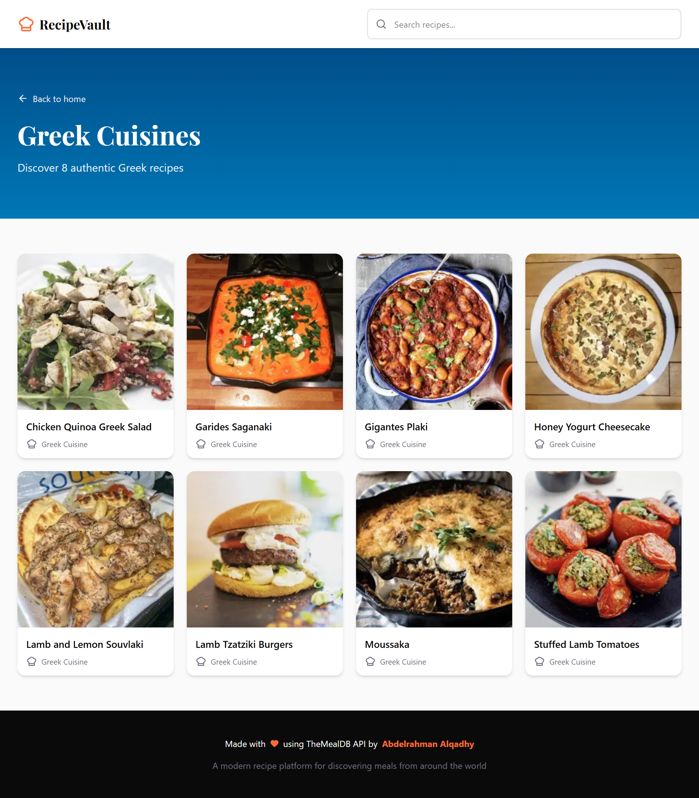
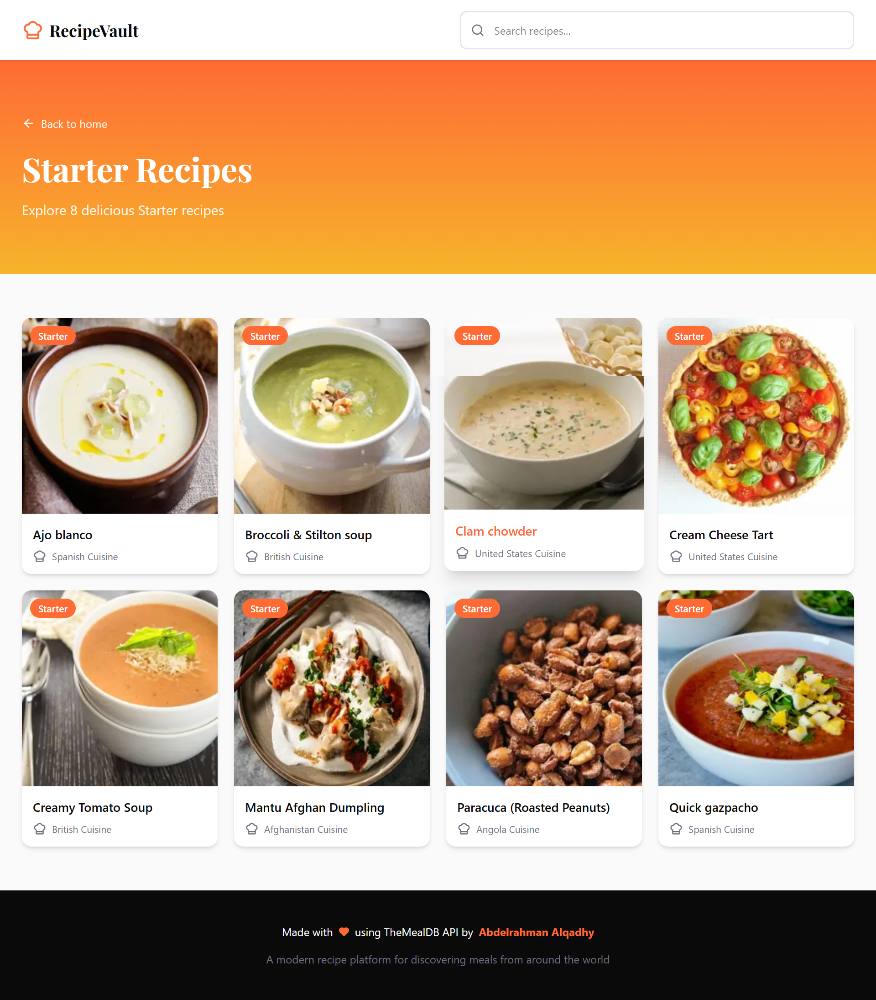

# 🍽️ RecipeVault

A modern and responsive recipe discovery platform built with **Next.js**, **React**, **Tailwind CSS**, and **TheMealDB API**.

Explore recipes from different cuisines around the world, browse meal categories, discover random dishes, watch cooking tutorials, and search for your favorite recipes — all within a clean and intuitive user experience.

---

## 🌐 Live Demo

🔗 **Demo:** [https://project-recipe-vault.netlify.app/]

---

## 📸 Screenshots

### 🏠 Home Page



### 🍲 Recipe Details



### 🔍 Search Page



### 🌎 Browse By Cuisine



### 📂 Browse By Category



---

## ✨ Features

### 🎲 Random Featured Recipe

Every visit introduces users to a randomly selected recipe displayed in the hero section, encouraging food discovery and exploration.

### 📂 Browse Recipes by Category

Users can explore recipes based on meal categories such as:

- Beef
- Chicken
- Seafood
- Dessert
- Vegetarian
- And more...

### 🌎 Explore Global Cuisines

Discover dishes from various cuisines around the world, including:

- Egyptian
- Italian
- American
- French
- Japanese
- Indian
- And many others

### 🍽️ Detailed Recipe Information

Each recipe contains:

- Recipe image
- Category
- Cuisine
- Ingredients list
- Measurements
- Cooking instructions

### 🎥 Cooking Video Integration

Recipes that provide video tutorials can be viewed directly through embedded YouTube links for a complete cooking experience.

### 🔍 Search Functionality

Quickly find recipes by searching for meal names.

### 📱 Fully Responsive Design

Optimized for:

- Desktop
- Tablet
- Mobile devices

---

## 🛣️ Application Routes

| Route            | Description                  |
| ---------------- | ---------------------------- |
| `/`              | Home page                    |
| `/recipe/[id]`   | Recipe details page          |
| `/category/[id]` | Recipes filtered by category |
| `/cuisine/[id]`  | Recipes filtered by cuisine  |
| `/search`        | Search recipes               |

---

## 🏗️ Project Architecture

The project follows a scalable and maintainable folder structure inspired by modern frontend development practices.

```text
src/
│
├── app/
├── components/
├── contexts/
├── services/
└── styles/
├── utils/
```

### Services Layer

A dedicated service layer was implemented to separate API communication from UI components.

Responsibilities include:

- API requests
- Data transformation
- Error handling
- Reusable business logic

---

## 🧰 Technologies Used

### Frontend

- Next.js
- React.js
- Tailwind CSS

### API Communication

- Axios

### External API

- TheMealDB API

### Language

- JavaScript (ES6+)

### Version Control

- Git
- GitHub

---

## 🚀 Getting Started

### Clone the repository

```bash
git clone https://github.com/alqadhy/RecipeVault.git
```

### Navigate into the project

```bash
cd RecipeVault
```

### Install dependencies

```bash
npm install
```

### Run the development server

```bash
npm run dev
```

### Open your browser

```text
http://localhost:3000
```

---

## 📚 What I Learned

Through building this project, I practiced and improved my understanding of:

- Modern Next.js App Router architecture
- Dynamic routing
- API integration using Axios
- Data fetching strategies
- Component-based architecture
- Responsive UI design
- Service layer organization
- Error and loading state handling
- Reusable React components
- Project structuring for scalability

---

## 🔮 Future Improvements

Potential future enhancements include:

- Favorites system
- Authentication
- Advanced filtering
- Infinite scrolling
- Pagination
- Dark mode
- Recipe bookmarking
- Ingredient-based search
- Server-side caching

---

### ⭐ If you enjoyed this project, consider giving it a star on GitHub!
